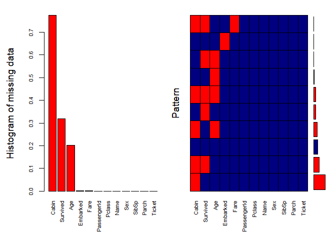
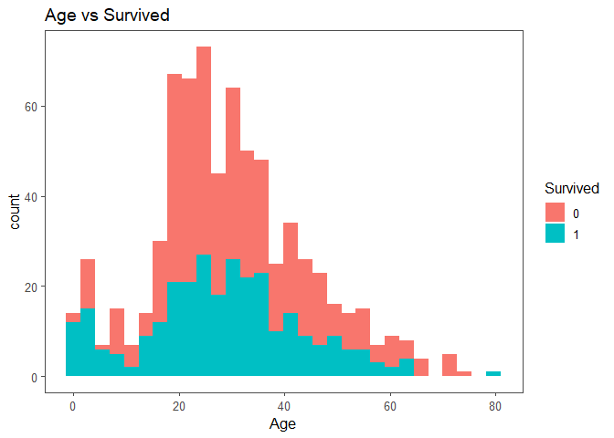
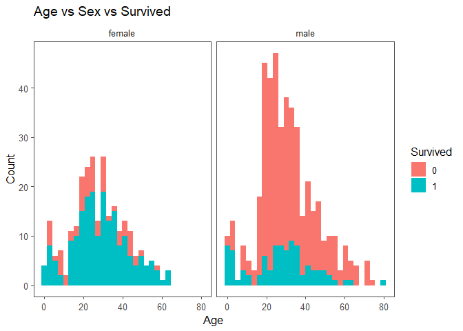
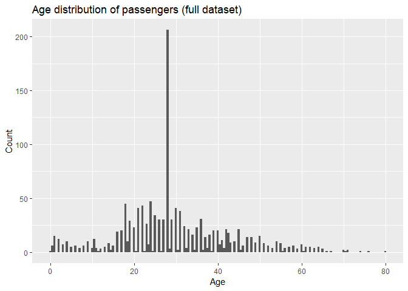
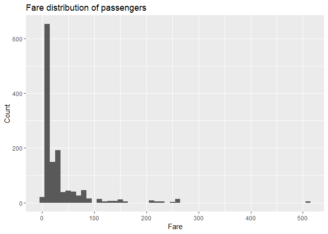
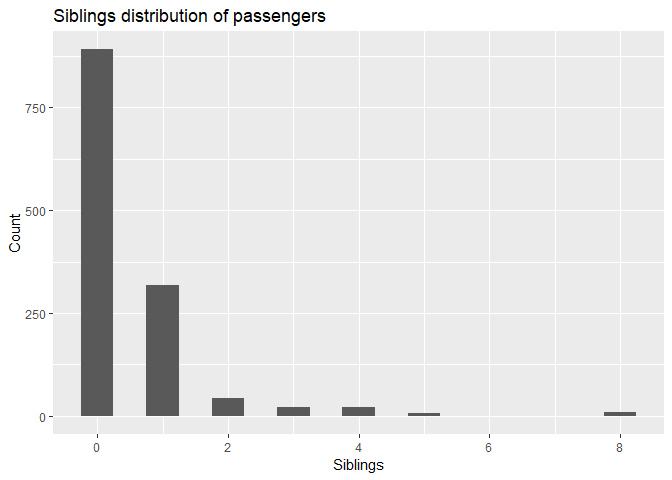
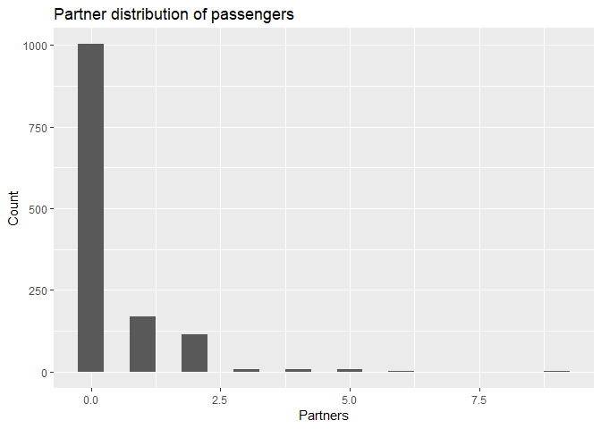
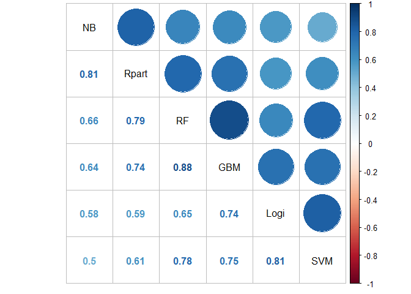

# Initialize packages


```r
# load packages and set options
options(stringsAsFactors = FALSE)

# install packages if not available
packages <- c("readr", #read data
              "lubridate", #date time conversion
              "tidyverse", # full set of pkgs
              "dplyr", #data exploratory + manipulation
              "caTools", # features engineering
              "ggplot2","ggthemes", "corrplot", # plotting graphs
              "caret", # ML libs
              "Hmisc" # EDA
)

if (length(setdiff(packages, rownames(installed.packages()))) > 0) {
  install.packages(setdiff(packages, rownames(installed.packages())))
}
lapply(packages, require, character.only = TRUE)
```

# Read data

Read train, test and submit sample data from input folder


```r
# set TryCatch for input folder (on kaggle kernel or local)

?tryCatch
test <- tryCatch(read_csv("../input/test.csv"),
                 error = function(e){
                   print('Detect working environment is not Kaggle kernel')
                   read_csv("./input/test.csv")
                 })

train <- tryCatch(read_csv("../input/train.csv"),
                 error = function(e){
                   print('Detect working environment is not Kaggle kernel')
                   read_csv("./input/train.csv")
                 })

# Add target variable
test$Survived <- NA
```

# EDA
Merge train and test dataset to get an overview of all features


```r
full <- rbind(train,test)
```
Visualize missing data using **VIM** package


```r
aggr_plot <- VIM::aggr(full, 
                       col=c('navyblue','red'), numbers=TRUE, sortVars=TRUE, labels=names(data), cex.axis=.7, gap=3,
                       ylab=c("Histogram of missing data","Pattern"))
```

```
## Warning in plot.aggr(res, ...): not enough horizontal space to display
## frequencies
```

<!-- -->

```
## 
##  Variables sorted by number of missings: 
##     Variable        Count
##        Cabin 0.7746371276
##     Survived 0.3193277311
##          Age 0.2009167303
##     Embarked 0.0015278839
##         Fare 0.0007639419
##  PassengerId 0.0000000000
##       Pclass 0.0000000000
##         Name 0.0000000000
##          Sex 0.0000000000
##        SibSp 0.0000000000
##        Parch 0.0000000000
##       Ticket 0.0000000000
```

- As can be seen "Cabin" feature has a lot of missing data. Since it recorded which cabins that passengers stayed on Titanic during the journey, I assume it is a MAR (missing-at-random) issue- some are recorded, some are not since the ticket class put them in common area (?)

- Another feature that contains many missing data is Age. It might be that the passengers did not put their ages when purchased the tickets.

With these findings, I tried both with traditional imputation (**Method 1**) where missing values are replaced by means or most common value; and with K-nn / BagImpute (**Method 2**) from the caret package.


```r
# Age vs Survived
ggplot(full[1:891,], aes(Age, fill = factor(Survived))) + 
  geom_histogram(bins=30) + 
  theme_few() +
  xlab("Age") +
  scale_fill_discrete(name = "Survived") + 
  ggtitle("Age vs Survived")
```

```
## Warning: Removed 177 rows containing non-finite values (stat_bin).
```

<!-- -->

```r
# Age vs Sex vs Survived
ggplot(full[1:891,], aes(Age, fill = factor(Survived))) + 
  geom_histogram(bins=30) + 
  theme_few() +
  xlab("Age") +
  ylab("Count") +
  facet_grid(.~Sex)+
  scale_fill_discrete(name = "Survived") + 
  theme_few()+
  ggtitle("Age vs Sex vs Survived")
```

```
## Warning: Removed 177 rows containing non-finite values (stat_bin).
```

<!-- -->

```r
# Replace Embarked with most common 
train$Embarked <- replace(train$Embarked, which(is.na(train$Embarked)), 'S')
full$Embarked <- replace(full$Embarked, which(is.na(full$Embarked)), 'S')

## Method 1- replace by mean

# # Replace missing age = mean of all ages / same with Fares
# train$Age[is.na(train$Age)] <- round(mean(train$Age, na.rm = T),0)
# train$Fare[is.na(train$Fare)] <- round(mean(train$Fare, na.rm = T),0)

# # Replace missing age = mean of all ages / same with Fares
# test$Age[is.na(test$Age)] <- round(mean(test$Age, na.rm = T),0)
# test$Fare[is.na(test$Fare)] <- round(mean(test$Fare, na.rm = T),0)


## Method 2- baggedImpute on full dataset
# Age + Fare are 2 missing variables

missing.df <- full %>%
  select(-c(Survived, Cabin, PassengerId, Name, Ticket))

missing_model <- caret::preProcess(missing.df, method = "bagImpute")
missing.result <- predict(missing_model, missing.df)

# Add back columns to full, train and test datasets
missing.result <- cbind(full$PassengerId, missing.result)

missing.result <- missing.result %>%
  rename(PassengerId = 'full$PassengerId') %>%
  select(PassengerId, Age, Fare)

full <- full %>%
  select(-c(Age,Fare))
full <- left_join(full,missing.result, by = "PassengerId")

train <- train %>% 
  select(-c(Age,Fare)) 
train <- left_join(train,missing.result, by = "PassengerId")

test <- test %>%
  select(-c(Age,Fare))
test <- left_join(test,missing.result, by = "PassengerId")
```

# Features Engineer

Exclude un-related features such as *PassengerId, Name, Ticket, Cabin*


```r
# Exclude unrelated features
train.df <- train %>%
  select(-c(PassengerId,
            Name,
            Ticket,
            Cabin))
```

## Binning for ages
- 0 to 18
- 18 to 65
- 65 and above


```r
# Age distribution (full dataset)
qplot(full$Age,
      geom = 'histogram', binwidth = 0.5,
      main = 'Age distribution of passengers (full dataset)',
      xlab = 'Age',
      ylab = 'Count')
```

<!-- -->

```r
# Binning for train
train.df <- train.df %>%
  mutate(Age_Range = case_when(
    Age < 18 ~ 'Kids',
    Age >=18 & Age < 60 ~ 'Adults',
    Age >=60 ~ 'Seniors'
  )) %>%
  select (-Age)
```
## Binning for fares
Cheapest < Cheap < Moderate < Expensive < Most expensive


```r
# Fare distribution
qplot(full$Fare,
      geom = 'histogram', binwidth = 10,
      main = 'Fare distribution of passengers',
      xlab = 'Fare',
      ylab = 'Count')
```

<!-- -->

```r
# Binning fare
train.df <- train.df %>%
  mutate(Fare_Range = case_when(
    Fare < 50 ~ 'Cheapest',
    Fare >= 50 & Fare < 100 ~ 'Cheap',
    Fare >= 100 & Fare < 200 ~ 'Moderate',
    Fare >= 200 & Fare < 500 ~ 'Expensive',
    Fare >= 500 ~ 'Most expensive'
  )) %>%
  select(-Fare)
```


## Siblings and partners count binning

More than 4 siblings/partners are considered as "Many", between 2 and 4 are "Some" and less than 2 are "Few"


```r
# Siblings distribution
qplot(full$SibSp,
      geom = 'histogram', binwidth = 0.5,
      main = 'Siblings distribution of passengers',
      xlab = 'Siblings',
      ylab = 'Count')
```

<!-- -->

```r
# Binning siblngs
train.df <- train.df %>%
  mutate(Siblings_Range = case_when(
    SibSp < 2 ~ 'Few',
    SibSp >= 2 & SibSp < 4 ~ 'Some',
    SibSp >= 4 ~ 'Many'
  )) %>%
  select(-SibSp)

#####
# Partner distribution
qplot(full$Parch,
      geom = 'histogram', binwidth = 0.5,
      main = 'Partner distribution of passengers',
      xlab = 'Partners',
      ylab = 'Count')
```

<!-- -->

```r
# Binning partner
train.df <- train.df %>%
  mutate(Partner_Range = case_when(
    Parch < 2 ~ 'Few',
    Parch >= 2 & Parch < 4 ~ 'Some',
    Parch >= 4 ~ 'Many'
  )) %>%
  select(-Parch)
```

Perform FE on test dataset


```r
# Replace Embarked with most common 
test$Embarked <- replace(test$Embarked, which(is.na(test$Embarked)), 'S')

# FE for test dataset
test.df <- test %>%
  select(-c(PassengerId,
            Name,
            Ticket,
            Cabin,
            Survived)) %>%
  mutate(Age_Range = case_when(
    Age < 18 ~ 'Kids',
    Age >=18 & Age < 60 ~ 'Adults',
    Age >=60 ~ 'Seniors'
  )) %>%
  select (-Age) %>%
  mutate(Partner_Range = case_when(
    Parch < 2 ~ 'Few',
    Parch >= 2 & Parch < 4 ~ 'Some',
    Parch >= 4 ~ 'Many'
  )) %>%
  select(-Parch) %>%
  mutate(Siblings_Range = case_when(
    SibSp < 2 ~ 'Few',
    SibSp >= 2 & SibSp < 4 ~ 'Some',
    SibSp >= 4 ~ 'Many'
  )) %>%
  select(-SibSp) %>%
  mutate(Fare_Range = case_when(
    Fare < 50 ~ 'Cheapest',
    Fare >= 50 & Fare < 100 ~ 'Cheap',
    Fare >= 100 & Fare < 200 ~ 'Moderate',
    Fare >= 200 & Fare < 500 ~ 'Expensive',
    Fare >= 500 ~ 'Most expensive'
  )) %>%
  select(-Fare)
```

# Models Development

Split into training and testing set (70-30)


```r
# Set seed for code reproduction

set.seed(1908)
split <- caTools::sample.split(train.df$Survived, SplitRatio = 0.7)

train.df$Survived <- as.factor(train.df$Survived)

real.train <- subset(train.df , split == TRUE)
real.test <- subset(train.df, split == FALSE)

# Cross-validation (5)
train_control <- trainControl(## 5-cross validation
  method = "cv",
  number = 5)
```

Starting off with base-line model with bayesian generalized linear model (logistic regression)


```r
LogiModel <- train(Survived ~.,
                   data = real.train,
                   method = 'bayesglm',
                   trControl = train_control)

# Prediction

pred.Logi <- predict(LogiModel,
                     newdata = real.test[,2:ncol(real.test)],
                     type = "raw")

CM.Logi <- confusionMatrix(as.factor(pred.Logi), real.test$Survived) # 84% acc
CM.Logi
```

```
## Confusion Matrix and Statistics
## 
##           Reference
## Prediction   0   1
##          0 141  19
##          1  24  84
##                                         
##                Accuracy : 0.8396        
##                  95% CI : (0.79, 0.8814)
##     No Information Rate : 0.6157        
##     P-Value [Acc > NIR] : 9.608e-16     
##                                         
##                   Kappa : 0.664         
##  Mcnemar's Test P-Value : 0.5419        
##                                         
##             Sensitivity : 0.8545        
##             Specificity : 0.8155        
##          Pos Pred Value : 0.8812        
##          Neg Pred Value : 0.7778        
##              Prevalence : 0.6157        
##          Detection Rate : 0.5261        
##    Detection Prevalence : 0.5970        
##       Balanced Accuracy : 0.8350        
##                                         
##        'Positive' Class : 0             
## 
```

```r
recall(CM.Logi$table) # 86%
```

```
## [1] 0.8545455
```

```r
precision(CM.Logi$table) # 88%
```

```
## [1] 0.88125
```

Testing with other models- Naive Bayes, Random Forest, SVM


```r
NB <- train(Survived ~.,
            data = real.train,
            method = 'naive_bayes',
            #na.action = na.pass,
            trControl = train_control,
            seed = 1234)

# Prediction

pred.NB <- predict(NB,
                   newdata = real.test[,2:ncol(real.test)],
                   na.action = na.pass,
                   type = "raw")

CM.NB <- confusionMatrix(as.factor(pred.NB), real.test$Survived) # 82% acc
CM.NB
```

```
## Confusion Matrix and Statistics
## 
##           Reference
## Prediction   0   1
##          0 156  41
##          1   9  62
##                                           
##                Accuracy : 0.8134          
##                  95% CI : (0.7615, 0.8582)
##     No Information Rate : 0.6157          
##     P-Value [Acc > NIR] : 2.048e-12       
##                                           
##                   Kappa : 0.5813          
##  Mcnemar's Test P-Value : 1.165e-05       
##                                           
##             Sensitivity : 0.9455          
##             Specificity : 0.6019          
##          Pos Pred Value : 0.7919          
##          Neg Pred Value : 0.8732          
##              Prevalence : 0.6157          
##          Detection Rate : 0.5821          
##    Detection Prevalence : 0.7351          
##       Balanced Accuracy : 0.7737          
##                                           
##        'Positive' Class : 0               
## 
```

```r
recall(CM.NB$table) # 95%
```

```
## [1] 0.9454545
```

```r
precision(CM.NB$table) # 79%
```

```
## [1] 0.7918782
```


```r
RF <- train(Survived ~.,
            data = real.train,
            method = 'rf',
            trControl = train_control,
            seed = 1234)

# Prediction

pred.rf <- predict(RF,
                   newdata = real.test[,2:ncol(real.test)],
                   type = "raw")

CM.RF <- confusionMatrix(as.factor(pred.rf), real.test$Survived) # 86% acc
CM.RF
```

```
## Confusion Matrix and Statistics
## 
##           Reference
## Prediction   0   1
##          0 158  35
##          1   7  68
##                                           
##                Accuracy : 0.8433          
##                  95% CI : (0.7941, 0.8847)
##     No Information Rate : 0.6157          
##     P-Value [Acc > NIR] : 2.894e-16       
##                                           
##                   Kappa : 0.651           
##  Mcnemar's Test P-Value : 3.097e-05       
##                                           
##             Sensitivity : 0.9576          
##             Specificity : 0.6602          
##          Pos Pred Value : 0.8187          
##          Neg Pred Value : 0.9067          
##              Prevalence : 0.6157          
##          Detection Rate : 0.5896          
##    Detection Prevalence : 0.7201          
##       Balanced Accuracy : 0.8089          
##                                           
##        'Positive' Class : 0               
## 
```

```r
recall(CM.RF$table) # 96%
```

```
## [1] 0.9575758
```

```r
precision(CM.RF$table)# 82%
```

```
## [1] 0.8186528
```

For SVM, since we only have few predictors over observations, I chose svmRadial (Gaussian) over svmLinear). Usually SVM should be able to yield better result with small dataset (which is our case)


```r
SVM <- train(Survived ~.,
                    data = real.train,
                    method = 'svmRadial',
                    trControl = train_control,
                    seed = 1234)
```

```
## Warning in .local(x, ...): Variable(s) `' constant. Cannot scale data.

## Warning in .local(x, ...): Variable(s) `' constant. Cannot scale data.

## Warning in .local(x, ...): Variable(s) `' constant. Cannot scale data.
```

```r
# Prediction

pred.SVM <- predict(SVM,
                           newdata = real.test[,2:ncol(real.test)],
                           type = "raw")

CM.SVM <- confusionMatrix(as.factor(pred.SVM), real.test$Survived) # 84% acc
CM.SVM
```

```
## Confusion Matrix and Statistics
## 
##           Reference
## Prediction   0   1
##          0 147  28
##          1  18  75
##                                           
##                Accuracy : 0.8284          
##                  95% CI : (0.7778, 0.8715)
##     No Information Rate : 0.6157          
##     P-Value [Acc > NIR] : 2.992e-14       
##                                           
##                   Kappa : 0.6306          
##  Mcnemar's Test P-Value : 0.1845          
##                                           
##             Sensitivity : 0.8909          
##             Specificity : 0.7282          
##          Pos Pred Value : 0.8400          
##          Neg Pred Value : 0.8065          
##              Prevalence : 0.6157          
##          Detection Rate : 0.5485          
##    Detection Prevalence : 0.6530          
##       Balanced Accuracy : 0.8095          
##                                           
##        'Positive' Class : 0               
## 
```

```r
recall(CM.SVM$table) # 89%
```

```
## [1] 0.8909091
```

```r
precision(CM.SVM$table)# 85%
```

```
## [1] 0.84
```


```r
Rpart <- train(Survived ~.,
               data = real.train,
               method = 'rpart',
               trControl = train_control)

# Prediction
pred.Rpart <- predict(Rpart,
                      newdata = real.test[,2:ncol(real.test)],
                      type = "raw")

CM.Rpart <- confusionMatrix(as.factor(pred.Rpart), real.test$Survived) # 80% acc
CM.Rpart
```

```
## Confusion Matrix and Statistics
## 
##           Reference
## Prediction   0   1
##          0 162  51
##          1   3  52
##                                           
##                Accuracy : 0.7985          
##                  95% CI : (0.7454, 0.8449)
##     No Information Rate : 0.6157          
##     P-Value [Acc > NIR] : 9.530e-11       
##                                           
##                   Kappa : 0.5334          
##  Mcnemar's Test P-Value : 1.596e-10       
##                                           
##             Sensitivity : 0.9818          
##             Specificity : 0.5049          
##          Pos Pred Value : 0.7606          
##          Neg Pred Value : 0.9455          
##              Prevalence : 0.6157          
##          Detection Rate : 0.6045          
##    Detection Prevalence : 0.7948          
##       Balanced Accuracy : 0.7433          
##                                           
##        'Positive' Class : 0               
## 
```

```r
recall(CM.Rpart$table) # 98%
```

```
## [1] 0.9818182
```

```r
precision(CM.Rpart$table)# 76%
```

```
## [1] 0.7605634
```


```r
GBM <- train(Survived ~.,
             data = real.train,
             method = 'gbm',
             trControl = train_control)
```

```
## Iter   TrainDeviance   ValidDeviance   StepSize   Improve
##      1        1.2892             nan     0.1000    0.0222
##      2        1.2517             nan     0.1000    0.0186
##      3        1.2198             nan     0.1000    0.0151
##      4        1.1967             nan     0.1000    0.0109
##      5        1.1736             nan     0.1000    0.0117
##      6        1.1524             nan     0.1000    0.0079
##      7        1.1360             nan     0.1000    0.0092
##      8        1.1195             nan     0.1000    0.0077
##      9        1.1059             nan     0.1000    0.0061
##     10        1.0956             nan     0.1000    0.0051
##     20        1.0133             nan     0.1000    0.0033
##     40        0.9624             nan     0.1000   -0.0009
##     60        0.9446             nan     0.1000    0.0003
##     80        0.9377             nan     0.1000   -0.0009
##    100        0.9336             nan     0.1000   -0.0006
##    120        0.9329             nan     0.1000   -0.0006
##    140        0.9316             nan     0.1000   -0.0010
##    150        0.9313             nan     0.1000   -0.0005
## 
## Iter   TrainDeviance   ValidDeviance   StepSize   Improve
##      1        1.2668             nan     0.1000    0.0310
##      2        1.2184             nan     0.1000    0.0255
##      3        1.1781             nan     0.1000    0.0169
##      4        1.1403             nan     0.1000    0.0184
##      5        1.1067             nan     0.1000    0.0153
##      6        1.0791             nan     0.1000    0.0118
##      7        1.0562             nan     0.1000    0.0089
##      8        1.0418             nan     0.1000    0.0066
##      9        1.0244             nan     0.1000    0.0068
##     10        1.0105             nan     0.1000    0.0055
##     20        0.9248             nan     0.1000    0.0015
##     40        0.8725             nan     0.1000    0.0002
##     60        0.8566             nan     0.1000   -0.0013
##     80        0.8486             nan     0.1000   -0.0013
##    100        0.8422             nan     0.1000   -0.0008
##    120        0.8371             nan     0.1000   -0.0008
##    140        0.8309             nan     0.1000   -0.0004
##    150        0.8299             nan     0.1000   -0.0017
## 
## Iter   TrainDeviance   ValidDeviance   StepSize   Improve
##      1        1.2635             nan     0.1000    0.0376
##      2        1.2040             nan     0.1000    0.0254
##      3        1.1567             nan     0.1000    0.0253
##      4        1.1168             nan     0.1000    0.0182
##      5        1.0879             nan     0.1000    0.0118
##      6        1.0597             nan     0.1000    0.0124
##      7        1.0408             nan     0.1000    0.0090
##      8        1.0210             nan     0.1000    0.0073
##      9        1.0012             nan     0.1000    0.0069
##     10        0.9849             nan     0.1000    0.0063
##     20        0.9025             nan     0.1000   -0.0002
##     40        0.8566             nan     0.1000    0.0001
##     60        0.8414             nan     0.1000   -0.0029
##     80        0.8313             nan     0.1000   -0.0008
##    100        0.8273             nan     0.1000   -0.0021
##    120        0.8237             nan     0.1000   -0.0016
##    140        0.8189             nan     0.1000   -0.0011
##    150        0.8181             nan     0.1000   -0.0020
```

```
## Warning in (function (x, y, offset = NULL, misc = NULL, distribution =
## "bernoulli", : variable 10: Fare_RangeMost expensive has no variation.
```

```
## Iter   TrainDeviance   ValidDeviance   StepSize   Improve
##      1        1.2818             nan     0.1000    0.0231
##      2        1.2475             nan     0.1000    0.0195
##      3        1.2146             nan     0.1000    0.0162
##      4        1.1865             nan     0.1000    0.0119
##      5        1.1662             nan     0.1000    0.0094
##      6        1.1449             nan     0.1000    0.0096
##      7        1.1233             nan     0.1000    0.0056
##      8        1.1125             nan     0.1000    0.0057
##      9        1.0955             nan     0.1000    0.0079
##     10        1.0806             nan     0.1000    0.0062
##     20        1.0054             nan     0.1000    0.0014
##     40        0.9603             nan     0.1000   -0.0001
##     60        0.9439             nan     0.1000   -0.0012
##     80        0.9360             nan     0.1000   -0.0007
##    100        0.9309             nan     0.1000   -0.0000
##    120        0.9287             nan     0.1000   -0.0015
##    140        0.9274             nan     0.1000   -0.0004
##    150        0.9271             nan     0.1000   -0.0005
```

```
## Warning in (function (x, y, offset = NULL, misc = NULL, distribution =
## "bernoulli", : variable 10: Fare_RangeMost expensive has no variation.
```

```
## Iter   TrainDeviance   ValidDeviance   StepSize   Improve
##      1        1.2697             nan     0.1000    0.0327
##      2        1.2239             nan     0.1000    0.0248
##      3        1.1802             nan     0.1000    0.0190
##      4        1.1474             nan     0.1000    0.0158
##      5        1.1226             nan     0.1000    0.0112
##      6        1.0995             nan     0.1000    0.0119
##      7        1.0753             nan     0.1000    0.0091
##      8        1.0567             nan     0.1000    0.0081
##      9        1.0426             nan     0.1000    0.0064
##     10        1.0331             nan     0.1000    0.0024
##     20        0.9351             nan     0.1000    0.0015
##     40        0.8856             nan     0.1000   -0.0005
##     60        0.8683             nan     0.1000   -0.0026
##     80        0.8553             nan     0.1000   -0.0007
##    100        0.8522             nan     0.1000   -0.0014
##    120        0.8487             nan     0.1000   -0.0006
##    140        0.8443             nan     0.1000   -0.0010
##    150        0.8433             nan     0.1000   -0.0009
```

```
## Warning in (function (x, y, offset = NULL, misc = NULL, distribution =
## "bernoulli", : variable 10: Fare_RangeMost expensive has no variation.
```

```
## Iter   TrainDeviance   ValidDeviance   StepSize   Improve
##      1        1.2629             nan     0.1000    0.0315
##      2        1.2123             nan     0.1000    0.0277
##      3        1.1644             nan     0.1000    0.0195
##      4        1.1296             nan     0.1000    0.0181
##      5        1.0948             nan     0.1000    0.0138
##      6        1.0686             nan     0.1000    0.0122
##      7        1.0470             nan     0.1000    0.0099
##      8        1.0292             nan     0.1000    0.0086
##      9        1.0134             nan     0.1000    0.0067
##     10        0.9991             nan     0.1000    0.0067
##     20        0.9179             nan     0.1000    0.0001
##     40        0.8767             nan     0.1000   -0.0021
##     60        0.8604             nan     0.1000   -0.0010
##     80        0.8502             nan     0.1000   -0.0022
##    100        0.8442             nan     0.1000   -0.0013
##    120        0.8405             nan     0.1000   -0.0027
##    140        0.8370             nan     0.1000   -0.0032
##    150        0.8349             nan     0.1000   -0.0013
## 
## Iter   TrainDeviance   ValidDeviance   StepSize   Improve
##      1        1.2873             nan     0.1000    0.0209
##      2        1.2497             nan     0.1000    0.0169
##      3        1.2262             nan     0.1000    0.0130
##      4        1.2048             nan     0.1000    0.0112
##      5        1.1879             nan     0.1000    0.0083
##      6        1.1671             nan     0.1000    0.0078
##      7        1.1471             nan     0.1000    0.0067
##      8        1.1314             nan     0.1000    0.0062
##      9        1.1200             nan     0.1000    0.0054
##     10        1.1076             nan     0.1000    0.0047
##     20        1.0423             nan     0.1000    0.0009
##     40        0.9884             nan     0.1000    0.0006
##     60        0.9712             nan     0.1000   -0.0014
##     80        0.9610             nan     0.1000   -0.0016
##    100        0.9574             nan     0.1000   -0.0026
##    120        0.9557             nan     0.1000   -0.0017
##    140        0.9523             nan     0.1000   -0.0000
##    150        0.9516             nan     0.1000   -0.0009
## 
## Iter   TrainDeviance   ValidDeviance   StepSize   Improve
##      1        1.2673             nan     0.1000    0.0281
##      2        1.2191             nan     0.1000    0.0231
##      3        1.1766             nan     0.1000    0.0201
##      4        1.1437             nan     0.1000    0.0141
##      5        1.1162             nan     0.1000    0.0134
##      6        1.0949             nan     0.1000    0.0103
##      7        1.0752             nan     0.1000    0.0099
##      8        1.0597             nan     0.1000    0.0074
##      9        1.0449             nan     0.1000    0.0065
##     10        1.0327             nan     0.1000    0.0053
##     20        0.9578             nan     0.1000    0.0026
##     40        0.9093             nan     0.1000   -0.0016
##     60        0.8894             nan     0.1000   -0.0007
##     80        0.8812             nan     0.1000   -0.0021
##    100        0.8754             nan     0.1000   -0.0009
##    120        0.8715             nan     0.1000   -0.0014
##    140        0.8663             nan     0.1000   -0.0012
##    150        0.8645             nan     0.1000   -0.0002
## 
## Iter   TrainDeviance   ValidDeviance   StepSize   Improve
##      1        1.2651             nan     0.1000    0.0284
##      2        1.2104             nan     0.1000    0.0226
##      3        1.1689             nan     0.1000    0.0182
##      4        1.1325             nan     0.1000    0.0183
##      5        1.1013             nan     0.1000    0.0129
##      6        1.0734             nan     0.1000    0.0138
##      7        1.0508             nan     0.1000    0.0097
##      8        1.0341             nan     0.1000    0.0088
##      9        1.0156             nan     0.1000    0.0062
##     10        1.0002             nan     0.1000    0.0061
##     20        0.9251             nan     0.1000    0.0024
##     40        0.8809             nan     0.1000   -0.0012
##     60        0.8671             nan     0.1000   -0.0000
##     80        0.8600             nan     0.1000   -0.0011
##    100        0.8547             nan     0.1000   -0.0034
##    120        0.8504             nan     0.1000   -0.0008
##    140        0.8475             nan     0.1000   -0.0013
##    150        0.8486             nan     0.1000   -0.0017
## 
## Iter   TrainDeviance   ValidDeviance   StepSize   Improve
##      1        1.2863             nan     0.1000    0.0264
##      2        1.2450             nan     0.1000    0.0214
##      3        1.2105             nan     0.1000    0.0171
##      4        1.1816             nan     0.1000    0.0138
##      5        1.1612             nan     0.1000    0.0113
##      6        1.1423             nan     0.1000    0.0085
##      7        1.1276             nan     0.1000    0.0069
##      8        1.1061             nan     0.1000    0.0087
##      9        1.0919             nan     0.1000    0.0071
##     10        1.0808             nan     0.1000    0.0032
##     20        1.0015             nan     0.1000    0.0015
##     40        0.9546             nan     0.1000   -0.0002
##     60        0.9422             nan     0.1000   -0.0000
##     80        0.9379             nan     0.1000   -0.0007
##    100        0.9371             nan     0.1000   -0.0013
##    120        0.9337             nan     0.1000    0.0007
##    140        0.9320             nan     0.1000   -0.0013
##    150        0.9269             nan     0.1000   -0.0004
## 
## Iter   TrainDeviance   ValidDeviance   StepSize   Improve
##      1        1.2687             nan     0.1000    0.0336
##      2        1.2118             nan     0.1000    0.0273
##      3        1.1616             nan     0.1000    0.0226
##      4        1.1292             nan     0.1000    0.0183
##      5        1.0954             nan     0.1000    0.0136
##      6        1.0689             nan     0.1000    0.0129
##      7        1.0502             nan     0.1000    0.0074
##      8        1.0303             nan     0.1000    0.0081
##      9        1.0172             nan     0.1000    0.0065
##     10        1.0015             nan     0.1000    0.0065
##     20        0.9250             nan     0.1000    0.0014
##     40        0.8821             nan     0.1000    0.0006
##     60        0.8636             nan     0.1000   -0.0010
##     80        0.8566             nan     0.1000   -0.0002
##    100        0.8519             nan     0.1000   -0.0010
##    120        0.8474             nan     0.1000   -0.0020
##    140        0.8425             nan     0.1000   -0.0014
##    150        0.8426             nan     0.1000   -0.0007
## 
## Iter   TrainDeviance   ValidDeviance   StepSize   Improve
##      1        1.2567             nan     0.1000    0.0379
##      2        1.1927             nan     0.1000    0.0273
##      3        1.1467             nan     0.1000    0.0231
##      4        1.1098             nan     0.1000    0.0188
##      5        1.0879             nan     0.1000    0.0087
##      6        1.0586             nan     0.1000    0.0111
##      7        1.0364             nan     0.1000    0.0098
##      8        1.0155             nan     0.1000    0.0097
##      9        0.9954             nan     0.1000    0.0056
##     10        0.9802             nan     0.1000    0.0072
##     20        0.9079             nan     0.1000    0.0008
##     40        0.8673             nan     0.1000   -0.0019
##     60        0.8560             nan     0.1000   -0.0024
##     80        0.8457             nan     0.1000   -0.0015
##    100        0.8418             nan     0.1000   -0.0014
##    120        0.8364             nan     0.1000   -0.0028
##    140        0.8326             nan     0.1000   -0.0022
##    150        0.8310             nan     0.1000   -0.0013
## 
## Iter   TrainDeviance   ValidDeviance   StepSize   Improve
##      1        1.2860             nan     0.1000    0.0233
##      2        1.2502             nan     0.1000    0.0184
##      3        1.2257             nan     0.1000    0.0144
##      4        1.2003             nan     0.1000    0.0125
##      5        1.1802             nan     0.1000    0.0099
##      6        1.1608             nan     0.1000    0.0071
##      7        1.1456             nan     0.1000    0.0074
##      8        1.1307             nan     0.1000    0.0062
##      9        1.1155             nan     0.1000    0.0055
##     10        1.1073             nan     0.1000    0.0047
##     20        1.0366             nan     0.1000    0.0025
##     40        0.9879             nan     0.1000    0.0004
##     60        0.9651             nan     0.1000    0.0001
##     80        0.9529             nan     0.1000   -0.0006
##    100        0.9468             nan     0.1000   -0.0005
##    120        0.9429             nan     0.1000   -0.0016
##    140        0.9396             nan     0.1000   -0.0005
##    150        0.9383             nan     0.1000   -0.0001
## 
## Iter   TrainDeviance   ValidDeviance   StepSize   Improve
##      1        1.2722             nan     0.1000    0.0316
##      2        1.2259             nan     0.1000    0.0214
##      3        1.1808             nan     0.1000    0.0190
##      4        1.1490             nan     0.1000    0.0143
##      5        1.1243             nan     0.1000    0.0087
##      6        1.1019             nan     0.1000    0.0072
##      7        1.0776             nan     0.1000    0.0080
##      8        1.0602             nan     0.1000    0.0092
##      9        1.0431             nan     0.1000    0.0056
##     10        1.0308             nan     0.1000    0.0029
##     20        0.9519             nan     0.1000    0.0013
##     40        0.8988             nan     0.1000   -0.0014
##     60        0.8842             nan     0.1000   -0.0005
##     80        0.8794             nan     0.1000   -0.0007
##    100        0.8753             nan     0.1000   -0.0012
##    120        0.8724             nan     0.1000   -0.0009
##    140        0.8695             nan     0.1000   -0.0004
##    150        0.8668             nan     0.1000   -0.0002
## 
## Iter   TrainDeviance   ValidDeviance   StepSize   Improve
##      1        1.2615             nan     0.1000    0.0319
##      2        1.2074             nan     0.1000    0.0240
##      3        1.1618             nan     0.1000    0.0191
##      4        1.1264             nan     0.1000    0.0141
##      5        1.0983             nan     0.1000    0.0101
##      6        1.0701             nan     0.1000    0.0126
##      7        1.0455             nan     0.1000    0.0086
##      8        1.0273             nan     0.1000    0.0089
##      9        1.0136             nan     0.1000    0.0073
##     10        1.0016             nan     0.1000    0.0038
##     20        0.9187             nan     0.1000    0.0009
##     40        0.8829             nan     0.1000   -0.0008
##     60        0.8712             nan     0.1000   -0.0017
##     80        0.8652             nan     0.1000   -0.0019
##    100        0.8595             nan     0.1000   -0.0005
##    120        0.8575             nan     0.1000   -0.0023
##    140        0.8539             nan     0.1000   -0.0015
##    150        0.8523             nan     0.1000   -0.0011
## 
## Iter   TrainDeviance   ValidDeviance   StepSize   Improve
##      1        1.2666             nan     0.1000    0.0331
##      2        1.2199             nan     0.1000    0.0253
##      3        1.1796             nan     0.1000    0.0210
##      4        1.1469             nan     0.1000    0.0166
##      5        1.1200             nan     0.1000    0.0131
##      6        1.0970             nan     0.1000    0.0106
##      7        1.0764             nan     0.1000    0.0102
##      8        1.0588             nan     0.1000    0.0079
##      9        1.0421             nan     0.1000    0.0071
##     10        1.0292             nan     0.1000    0.0071
##     20        0.9465             nan     0.1000    0.0025
##     40        0.8939             nan     0.1000   -0.0001
##     60        0.8778             nan     0.1000   -0.0008
##     80        0.8701             nan     0.1000   -0.0003
##    100        0.8662             nan     0.1000   -0.0007
```

```r
# Prediction

pred.GBM <- predict(GBM,
                    newdata = real.test[,2:ncol(real.test)],
                    type = "raw")

CM.GBM <- confusionMatrix(as.factor(pred.GBM), real.test$Survived) # 86% acc
CM.GBM
```

```
## Confusion Matrix and Statistics
## 
##           Reference
## Prediction   0   1
##          0 159  30
##          1   6  73
##                                           
##                Accuracy : 0.8657          
##                  95% CI : (0.8189, 0.9041)
##     No Information Rate : 0.6157          
##     P-Value [Acc > NIR] : < 2.2e-16       
##                                           
##                   Kappa : 0.7032          
##  Mcnemar's Test P-Value : 0.0001264       
##                                           
##             Sensitivity : 0.9636          
##             Specificity : 0.7087          
##          Pos Pred Value : 0.8413          
##          Neg Pred Value : 0.9241          
##              Prevalence : 0.6157          
##          Detection Rate : 0.5933          
##    Detection Prevalence : 0.7052          
##       Balanced Accuracy : 0.8362          
##                                           
##        'Positive' Class : 0               
## 
```

```r
recall(CM.GBM$table) # 96%
```

```
## [1] 0.9636364
```

```r
precision(CM.GBM$table)# 84%
```

```
## [1] 0.8412698
```

### Ensemble Modeling (Voting, Bagging, Boosting) to get best results


```r
# Apply models to test.df
pred.Logi <- predict(LogiModel,
                     newdata = test.df[,1:ncol(test.df)],
                     #na.action = na.pass,
                     type = "raw"
)

pred.NB <- predict(NB,
                   newdata = test.df[,1:ncol(test.df)],
                   #na.action = na.pass,
                   type = "raw")

pred.rf <- predict(RF,
                   newdata = test.df[,1:ncol(test.df)],
                   #na.action = na.pass,
                   type = "raw")

pred.Rpart <- predict(Rpart,
                      newdata = test.df[,1:ncol(test.df)],
                      na.action = na.pass,
                      type = "raw")

pred.SVM <- predict(SVM,
                           newdata = test.df[,1:ncol(test.df)],
                           #na.action = na.pass,
                           type = "raw")
pred.GBM <- predict(GBM,
                    newdata = test.df[,1:ncol(test.df)],
                    #na.action = na.pass,
                    type = "raw")


submission <- test %>%
  select(PassengerId)
submission <- cbind(submission,
                    as.numeric(pred.Logi),
                    as.numeric(pred.NB),
                    as.numeric(pred.rf),
                    as.numeric(pred.Rpart),
                    as.numeric(pred.SVM),
                    as.numeric(pred.GBM))
colnames(submission) <- c('PassengerId',
                          'Logi',
                          'NB',
                          'RF',
                          'Rpart',
                          'SVM',
                          'GBM')

submission <- submission %>%
  mutate(Logi = ifelse(Logi == 1,0,1),
         NB = ifelse(NB == 1,0,1),
         RF = ifelse(RF == 1,0,1),
         Rpart = ifelse(Rpart == 1,0,1),
         SVM = ifelse(SVM == 1,0,1),
         GBM = ifelse(GBM == 1,0,1))
```


```r
#compose correlations plot
corrplot.mixed(cor(submission[,2:ncol(submission)]), order="hclust", tl.col="black")
```

<!-- -->


```r
# GBM only
submission.GBM <- submission %>%
  select(PassengerId, GBM) %>%
  rename(Survived = GBM)

write.csv(submission.GBM,'GBM.csv',
          row.names = FALSE)

##########
# SVM only
submission.SVM <- submission %>%
  select(PassengerId, SVM) %>%
  rename(Survived = SVM)

write.csv(submission.SVM,'SVM.csv',
          row.names = FALSE)

###################
# Naive Bayes only
submission.NB <- submission %>%
  select(PassengerId, NB) %>%
  rename(Survived = NB)

write.csv(submission.NB,'NB.csv',
          row.names = FALSE)

###################
# CART only
submission.Rpart <- submission %>%
  select(PassengerId, Rpart) %>%
  rename(Survived = Rpart)

write.csv(submission.Rpart,'RPart.csv',
          row.names = FALSE)

###################
# Random Forest only
submission.RF <- submission %>%
  select(PassengerId, RF) %>%
  rename(Survived = RF)

write.csv(submission.RF,'RF.csv',
          row.names = FALSE)

###################

# Majority Voting
submission.Major <- submission %>%
  mutate(Survived = Logi + NB + RF + Rpart + SVM + GBM) %>%
  mutate(Survived = ifelse(Survived >= 3,1,0))

submission.Major <- submission.Major %>%
  select(PassengerId, Survived)
write.csv(submission.Major,'Major.csv',
          row.names = FALSE)
```
